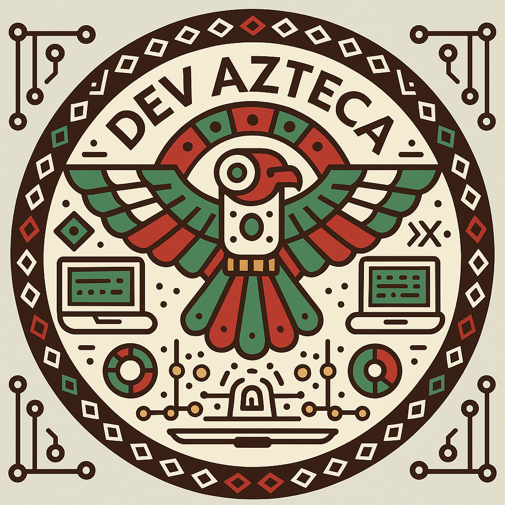

  

<h1 align="center">Dev Azteca</h1>

  <strong>Desarrollador de aplicaciones móviles nativas</strong>
   
  Kotlin Multiplatform · Compose Multiplatform · React
   
  <a href="https://eldevazteca.dev" target="_blank">eldevazteca.dev</a>

  
  
  
  
  
  
  
  
  
  
  

---

### 👨‍💻 Sobre mí

Soy un desarrollador apasionado por las aplicaciones móviles nativas y multiplataforma. Actualmente me especializo en **Kotlin Multiplatform** y **Compose Multiplatform**, creando apps que funcionan en Android, iOS y escritorio desde una sola base de código.

También trabajo con **React** para el frontend web, y **Firebase, SQLite y PostgreSQL** para el backend y almacenamiento de datos. En mi tiempo libre exploro el mundo de **Arduino y ESP8266**.

---

### 📊 GitHub Stats

  
  

---

### 📫 Contacto

  
  
  

---

### ⚡ Actividad reciente

Últimos commits y PRs en **Azteca Wallet** y otros proyectos.

<!--START_SECTION:activity-->
<!--END_SECTION:activity-->
